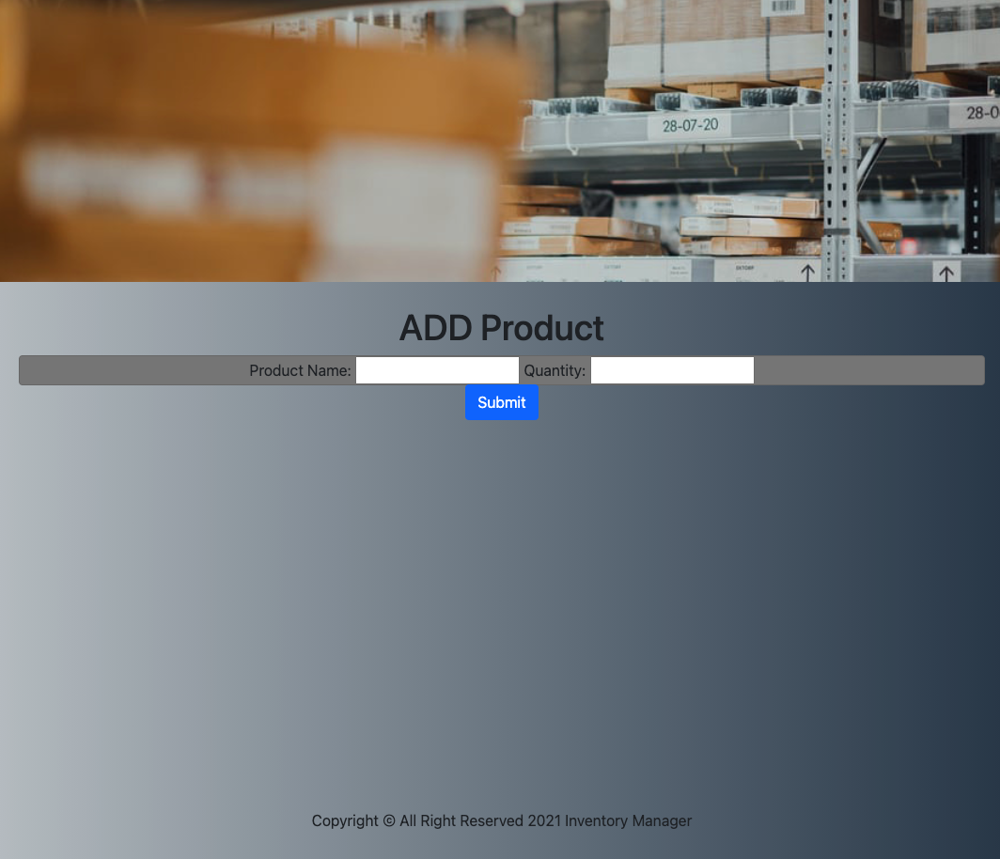
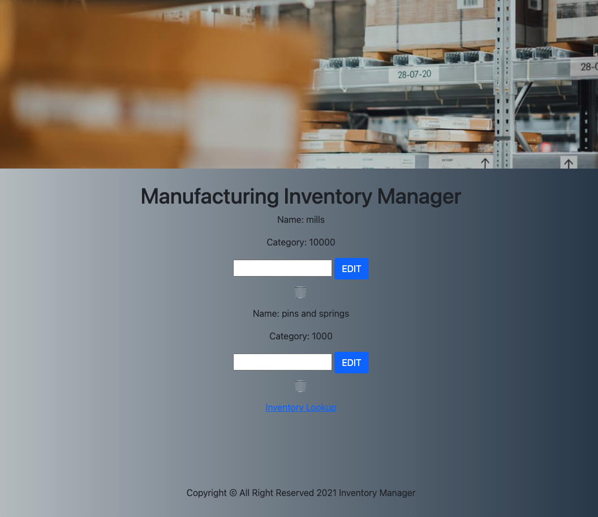

# Manufacturing Inventory Manager  🗄

A simple app that performes CRUD, Named Manufacturing Inventory Manager. This app is for capstone project week. I am to demonstate the ability to learn something new. I choose Bootstrap because I have always been interested in it.

## Technologies Used  ⚙️

- CSS3
- HTML
- JS
- Mongoose
- Mongodb
- Express
- Github (for back-up and documentation purposes)
- Heroku (for deployment)

## Screenshots

## Getting started  🚴🏽‍♂️

[Click]" ) here to get started and see the app online!

## Future Enhancements  🛠

To make it responsive with Bootstrap 